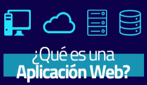
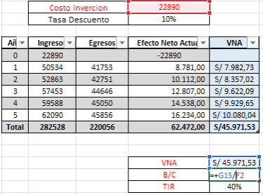
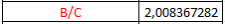
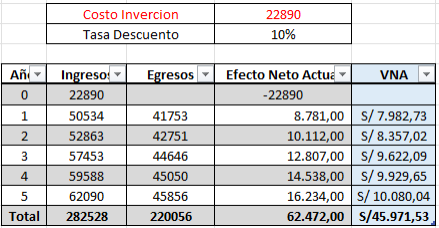
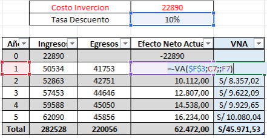
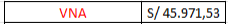
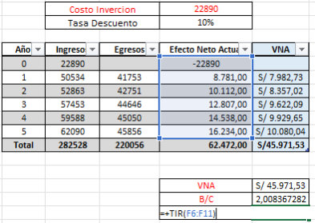
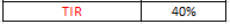



**UNIVERSIDAD PRIVADA DE TACNA**

**FACULTAD DE INGENIERÍA**

**Escuela Profesional de Ingeniería de Sistemas**

**Documento Informe de Proyecto Final**

**Plataforma Avanzada para la Generación Automática de Diagramas UML empresa Tech Solutions**

**Curso:** Patrones de Software

**Docente:** Mg. Patrick Jose Cuadros Quiroga

**Integrantes:**

\- Alexis Jeanpierre Martínez Vargas			(2019063638)

\- Juan José David Pérez Vizcarra				(2019063636)

\- Jhon Thomas Ticona Chambi				(2018062232)

**TACNA – PERÚ**

**2025**

**Plataforma Avanzada para la Generación Automática de Diagramas UML empresa Tech Solutions**

**Documento Informe de Proyecto Final**

*Documentador*

*Alexis Jeanpierre Martínez Vargas*

Versión *1.0*

|**CONTROL DE VERSIONES**||||||
| :-: | :- | :- | :- | :- | :- |
|Versión|Hecha por|Revisada por|Aprobada por|Fecha|Motivo|
|1\.0|AMV|AMV, JTC,JJPV|AMV, JTC,JJPV|26/05/2025|Versión Preliminar|
# **Índex**
[1. Antecedentes	4](#_toc181973815)

[2. Planteamiento del Problema	4](#_toc181973816)

[2.1 Problema	4](#_toc181973817)

[2.2 Justificación	5](#_toc181973818)

[2.3 Alcance	5](#_toc181973819)

[3. Objetivos	6](#_toc181973820)

[3.1 Objetivo General	6](#_toc181973821)

[3.2 Objetivos Específicos	6](#_toc181973822)

[4. Marco Teórico	6](#_toc181973823)

[4.1 Aplicación Web	6](#_toc181973824)

[5. Desarrollo de Solución	7](#_toc181973825)

[5.1 Análisis de Factibilidad	7](#_toc181973826)

[5.1.1 Factibilidad Económica	7](#_toc181973827)

[5.1.2 Factibilidad Operativa	10](#_toc181973828)

[5.1.3 Factibilidad Legal	11](#_toc181973829)

[5.1.4 Factibilidad Ambiental	11](#_toc181973830)

[5.2 Metodología de Desarrollo	12](#_toc181973831)

[5.3 Metodología de Implementación	13](#_toc181973832)

[6. Cronograma	13](#_toc181973833)

[7. Presupuesto	14](#_toc181973834)

[8. Conclusiones	14](#_toc181973835)

[9. Recomendaciones	14](#_toc181973836)

[10. Bibliografía	15](#_toc181973837)

[11. Anexos	15](#_toc181973838)

**INFORME PROYECTO FINAL**
# **1. Antecedentes**
La creación de diagramas UML es una actividad clave en la ingeniería de software, ya que permite representar visualmente la arquitectura, comportamiento y relaciones entre los componentes de un sistema. No obstante, esta tarea puede volverse compleja, repetitiva y propensa a errores si se realiza manualmente, especialmente en proyectos con cambios frecuentes o en equipos de trabajo distribuidos.

En respuesta a esta necesidad, surge el desarrollo de una plataforma avanzada que automatice la generación y validación de diagramas UML a partir de diversas fuentes de entrada como código fuente, modelos estructurados (JSON/YAML) y ediciones gráficas manuales. Esta solución está orientada tanto a entornos académicos como profesionales, permitiendo a estudiantes, desarrolladores y equipos técnicos documentar sus proyectos de manera más eficiente, precisa y colaborativa.

La herramienta propuesta busca integrar funcionalidades que actualmente suelen encontrarse de manera fragmentada en diferentes aplicaciones. Entre sus características más relevantes se encuentran la generación automática de diagramas a partir de código, la edición gráfica con validación en tiempo real, el trabajo colaborativo entre múltiples usuarios y la integración con repositorios de control de versiones. Todo ello con una interfaz intuitiva, accesible desde múltiples dispositivos, y con posibilidades de ampliación mediante plugins para soportar nuevos lenguajes o estilos de diagramación.

La implementación de esta plataforma no solo contribuirá a optimizar el tiempo y los recursos en el proceso de documentación, sino que también fomentará mejores prácticas de diseño en el desarrollo de software, mejorando la comprensión del sistema y facilitando la comunicación entre los miembros del equipo.
# **2. Planteamiento del Problema**
## **2.1 Problema**
En los procesos de diseño y documentación de software, la creación de diagramas UML sigue siendo una tarea fundamental para representar visualmente la arquitectura, relaciones y comportamientos de los sistemas. Sin embargo, muchas veces este proceso se realiza de forma manual, lo que implica un consumo significativo de tiempo, una alta probabilidad de errores y dificultades para mantener actualizada la documentación cuando el código fuente evoluciona.

A pesar de la existencia de herramientas para generar diagramas UML, muchas de ellas presentan limitaciones como falta de integración con el código fuente, escasa validación automática, interfaces poco intuitivas o ausencia de funciones colaborativas. Esto dificulta su adopción en entornos académicos y profesionales, donde la agilidad, precisión y colaboración son esenciales.

Por lo tanto, el problema central que aborda este proyecto es:\
¿Cómo desarrollar una plataforma automatizada, intuitiva y colaborativa que facilite la generación, validación y edición de diagramas UML a partir de múltiples fuentes como código, archivos estructurados y ediciones manuales, mejorando así la comprensión y documentación del diseño de software?

## **2.2 Justificación**
El desarrollo de una Plataforma Avanzada para la Generación Automática de Diagramas UML se justifica por los siguientes motivos clave:

- **Optimización de tiempos y reducción de errores:** Automatizar la generación de diagramas UML permitirá a los usuarios ahorrar tiempo valioso y reducir errores humanos al interpretar o trasladar el diseño desde el código hacia un modelo visual.
- **Facilidad de uso e interfaz intuitiva:** Al enfocarse en una experiencia de usuario sencilla y amigable, se ampliará el acceso a esta herramienta tanto para estudiantes como para profesionales, sin requerir un alto nivel técnico para su uso.
- **Soporte multiplataforma y extensibilidad:** Al diseñarse como una aplicación web extensible, la plataforma será accesible desde distintos dispositivos y podrá adaptarse fácilmente a nuevos lenguajes de programación o estándares de diagramación mediante plugins.
- **Fomento del trabajo colaborativo:** Las funciones de colaboración en tiempo real fortalecerán el trabajo en equipo, permitiendo la co-edición de diagramas entre múltiples usuarios, característica especialmente útil en ambientes de desarrollo ágil o académico.
- **Validación estructural y sintáctica:** La plataforma no solo permitirá crear diagramas, sino que también incluirá mecanismos de validación para asegurar la coherencia de los modelos generados, detectando relaciones inválidas o errores sintácticos en tiempo real.

En conjunto, este proyecto representa una solución moderna e integral que responde a las necesidades actuales de documentación técnica y colaboración en el desarrollo de software.
## **2.3 Alcance**
Este proyecto comprende el diseño, desarrollo e implementación de una plataforma web que permitirá a los usuarios generar, editar y validar diagramas UML de manera automática y colaborativa. La plataforma incluirá las siguientes funcionalidades:

- **Conversión de código fuente a UML:** Generación automática de diagramas de clases, secuencia, casos de uso y componentes a partir de código en C#, Python y Java, utilizando reglas predefinidas.
- **Soporte para modelos JSON/YAML:** Lectura de archivos estructurados para construir diagramas a partir de descripciones técnicas.
- **Editor gráfico asistido:** Herramienta de edición visual que permitirá modificar manualmente los diagramas con validación en tiempo real.
- **Colaboración en línea:** Edición simultánea de diagramas entre varios usuarios mediante sesiones colaborativas.
- **Historial de versiones:** Integración con Git para generar diagramas UML a partir del historial de cambios del proyecto.
- **Exportación en múltiples formatos:** Posibilidad de exportar los diagramas en formatos gráficos (PNG, SVG, PDF) o como código (PlantUML, Mermaid).
- **Extensibilidad:** Soporte para plugins que permitirán incorporar nuevos lenguajes de programación o estilos de modelado.

La plataforma estará dirigida a estudiantes, docentes y desarrolladores de software, y será diseñada para funcionar correctamente en navegadores modernos y múltiples dispositivos. El equipo de desarrollo será responsable del diseño, programación, pruebas y documentación técnica de la solución.
# **3. Objetivos**
## **3.1 Objetivo General**
El objetivo general de este proyecto es desarrollar e implementar una plataforma avanzada que facilite la generación automática y validación de diagramas UML, mejorando la comprensión y documentación del diseño de software en entornos académicos y profesionales. Esta herramienta optimizará la creación de diagramas a partir de código fuente, modelos estructurados y ediciones manuales con validación en tiempo real.
## **3.2 Objetivos Específicos**
- Desarrollar un sistema capaz de analizar código fuente y convertirlo en diagramas UML basándose en reglas predefinidas.
- Implementar un editor gráfico asistido que permita a los usuarios construir diagramas UML con validación en tiempo real.
- Crear un módulo de colaboración en tiempo real para la edición compartida de diagramas UML entre múltiples usuarios.
- Integrar la generación de diagramas UML a partir del historial de cambios en repositorios Git.
- Diseñar un sistema extensible mediante plugins, permitiendo la incorporación de nuevos lenguajes y reglas de análisis.
- Garantizar una interfaz intuitiva y adaptable para su uso en distintos dispositivos y navegadores.
# **4. Marco Teórico**
## **4.1 Aplicación Web**

Las aplicaciones web son herramientas que permiten a los usuarios acceder a un servidor web a través de la red utilizando un navegador específico.

Estas aplicaciones están basadas en la arquitectura cliente-servidor. Utilizan scripts del lado del servidor, como PHP y ASP, para gestionar el almacenamiento y recuperación de información, y scripts del lado del cliente, como JavaScript y HTML, para mostrar la información a los usuarios. Esto permite la interacción a través de formularios en línea, sistemas de gestión de contenido, carritos de compra, entre otros.

Características de las aplicaciones web:

- No requieren descarga e instalación en el dispositivo: Estas aplicaciones están alojadas en un servidor y se pueden acceder a ellas desde cualquier navegador, evitando las restricciones de espacio en el dispositivo del usuario.
- Son altamente compatibles y accesibles: Se desarrollan una vez y pueden funcionar en diferentes sistemas operativos, siendo accesibles desde cualquier dispositivo con conexión a Internet.
- El mantenimiento y la actualización son sencillos: Todos los usuarios utilizan la misma versión de la aplicación, lo que elimina las incompatibilidades de versión y facilita las tareas de mantenimiento y actualización.
# **5. Desarrollo de Solución**
## **5.1 Análisis de Factibilidad**
### **5.1.1 Factibilidad Económica**
**Criterios de Inversión**

Nuestros criterios de inversión se basan en los tres criterios presentados en base a que se necesitara el B/C para saber si hay beneficios, El VAN para saber si es aceptable el valor del proyecto y el TIR si es que se puede obtener retornar los gastos, ya que necesitamos recuperar de los costos invertidos al desarrollarse en el trayecto del tiempo. En ello, podemos utilizar a esos criterios debido a que queremos que el proyecto cumpla con todos los requisitos y con los valores económicos para ser aceptado	

|**FLUJO DE CAJA**||||
| :-: | :- | :- | :- |
|**PERIODO ANUAL**|**INGRESOS**|**EGRESOS**|**EFECTIVO NETO ACTUAL**|
|0|-S/  22,890.00| |-S/  22,890.00|
|1|` `S/   50,534.00 |` `S/    41,753.00 |` `S/     8,781.00 |
|2|` `S/   52,863.00 |` `S/    42,751.00 |` `S/   10,112.00 |
|3|` `S/   57,453.00 |` `S/    44,646.00 |` `S/   12,807.00 |
|4|` `S/   59,588.00 |` `S/    45,050.00 |` `S/   14,538.00 |
|5|` `S/   62,090.00 |` `S/    45,856.00 |` `S/   16,234.00 |
|**Total**|**S/ 282,528.00**|**S/220,056.00**|**S/62.472.00**|

**Relación Beneficio/Costo (B/C)**

*Tabla 8 –  Tabla realizada en el Excel con los datos correspondiste del proyecto a realizar donde realizamos la formula de B/C y el Total de nuestro **B/C  = 2,008367282***

**Valor Actual Neto (VAN)**

*Tabla 10 –  Tabla realizada en el Excel con los datos correspondiste del proyecto a realizar donde realizamos la formula de VNA y el Total de nuestro **VNA = S/45.,971.53***

**Tasa Interna de Retorno (TIR)**

*Tabla 12 - Tabla realizada en el Excel con los datos correspondiste del proyecto a realizar donde realizamos la formula de TIR y el Total de nuestro **TIR = 40% , Lo que nos indica que el proyecto si es factible.***

### **5.1.2 Factibilidad Operativa**

La factibilidad operativa de este proyecto se refiere a su capacidad para funcionar de manera eficiente y sostenible una vez que esté en funcionamiento. Esto implica:

**Recursos Humanos y Capacitación:**

Es fundamental contar con personal calificado en áreas como desarrollo web, inteligencia artificial, administración de sistemas y tecnología de la información. Además, se proporcionará capacitación continua para garantizar que el equipo esté actualizado en las últimas tendencias y técnicas en desarrollo de software y gestión de inventarios. Esto asegurará que el personal pueda manejar eficazmente el sistema y aprovechar al máximo sus capacidades.

**Instalaciones y Equipamiento:**

Aunque este proyecto no requiere instalaciones físicas específicas, es esencial disponer de una infraestructura tecnológica robusta que soporte el sistema web y las funcionalidades de inteligencia artificial. Esto incluye servidores confiables, software actualizado y los recursos tecnológicos necesarios para el desarrollo, la implementación y el mantenimiento del sistema. También se debe asegurar una conectividad a Internet estable y de alta velocidad para garantizar el acceso ininterrumpido a la plataforma.

**Cumplimiento de Normativas y Licencias:**

Es crucial cumplir con las normativas legales y regulatorias aplicables, especialmente en términos de protección de datos y seguridad cibernética. Además, se debe garantizar que el sistema cumpla con cualquier requerimiento específico establecido por las autoridades locales y regionales en cuanto a la gestión de inventarios y la elaboración de informes técnicos. Esto incluye la obtención de licencias necesarias y la adhesión a las mejores prácticas de la industria para asegurar la confiabilidad y credibilidad del sistema.

### **5.1.3 Factibilidad Legal**

Listamos algunas leyes y regulaciones relevantes que podrían afectar la factibilidad legal del proyecto:

- **Ley N° 29733, Ley de Protección de Datos Personales:** Esta ley es crucial, dado que el proyecto manejará datos sensibles de los equipos tecnológicos y posiblemente de los usuarios. Es necesario garantizar el cumplimiento de esta ley para proteger la privacidad de los datos y evitar posibles sanciones por el manejo inadecuado de la información.
- **Ley N° 30096, Ley Anti-Phishing:** Aunque esta ley no está directamente relacionada con la gestión de inventarios, es importante considerarla porque el sistema web podría ser vulnerable a intentos de suplantación de identidad con fines fraudulentos. Implementar medidas de seguridad adecuadas ayudará a prevenir tales ataques y proteger la información crítica del sistema.
  ### **5.1.4 Factibilidad Ambiental**
  El proyecto "Sistema Web de Gestión de Inventario y Elaboración de Informes Técnicos implementado con IA" tiene un impacto ambiental mínimo, ya que su implementación y operación no implican procesos que generen emisiones contaminantes o consuman recursos naturales de manera significativa:

- **Ecoeficiencia en el Consumo de Energía:** Se prevé que el proyecto sea ecoeficiente, utilizando tecnologías y prácticas que minimicen el consumo de energía y reduzcan al mínimo la generación de residuos electrónicos. Esto incluye el uso de servidores energéticamente eficientes y la minimización del uso de papel a través de la digitalización de procesos.
- **Cumplimiento de Políticas Ambientales:** El desarrollo del proyecto se llevará a cabo en cumplimiento con las políticas y regulaciones ambientales locales y nacionales, asegurando que todas las actividades relacionadas con su implementación y operación se realicen de manera responsable y sostenible.
- **Promoción de la Conciencia Ambiental:** Aunque el impacto directo del proyecto en el medio ambiente es bajo, este puede servir como un ejemplo de cómo las tecnologías de la información pueden contribuir a la sostenibilidad. Al automatizar procesos y reducir el uso de recursos físicos, el sistema puede ayudar a promover una cultura organizacional más consciente del medio ambiente.

## **5.2 Metodología de Desarrollo**
Rational Unified Process (RUP):

Es una metodología de desarrollo de software ampliamente utilizada. Fue desarrollada por Rational Software Corporation, adquirida por IBM en 2003. El RUP se basa en principios de desarrollo iterativo e incremental, lo que significa que el proyecto se divide en fases y cada fase se completa en ciclos o iteraciones.

El RUP proporciona un marco de trabajo estructurado y disciplinado para el desarrollo de software. Está basado en las mejores prácticas de la industria y se centra en la colaboración entre los miembros del equipo, la gestión del riesgo y la entrega de software de alta calidad.

El proceso de desarrollo en RUP se organiza en cuatro fases principales: inicio, elaboración, construcción y transición. Cada fase tiene sus propios objetivos y actividades específicas. Durante el proceso, se enfatiza la importancia de la comunicación con los interesados, la documentación adecuada y la gestión efectiva del cambio.
## **5.3 Metodología de Implementación**
HTTP: El Protocolo de Transferencia de Hipertexto (HTTP, por sus siglas en inglés) es el protocolo de comunicación utilizado en la World Wide Web. Permite la transferencia de información entre un cliente (generalmente un navegador web) y un servidor web. HTTP se basa en el modelo cliente-servidor, donde el cliente envía solicitudes al servidor y este responde con los datos solicitados. Es un protocolo sin estado, lo que significa que cada solicitud es independiente y no guarda información sobre las solicitudes anteriores. HTTP utiliza métodos como GET, POST, PUT y DELETE para realizar diferentes tipos de solicitudes y operaciones en los recursos web.

UML: El Lenguaje Unificado de Modelado (UML, por sus siglas en inglés) es un estándar internacionalmente adoptado para la representación visual y documentación de sistemas de software. Proporciona un conjunto de diagramas y notaciones que permiten describir la estructura, el comportamiento y las relaciones entre los componentes de un sistema. UML es utilizado por analistas, diseñadores y desarrolladores de software para comunicar y documentar los conceptos y las decisiones de diseño de manera clara y precisa. Los diagramas UML más comunes incluyen diagramas de casos de uso, diagramas de clases, diagramas de secuencia y diagramas de actividad, entre otros. UML facilita la comprensión, la colaboración y la implementación de sistemas de software complejos.
# **6. Cronograma**
Se han elaborado la estimación de los recursos en base a la experiencia de personal de cómputo, reuniones de trabajo con jefes de área y documentos que indican requerimientos.

El cronograma del trabajo mensual para el desarrollo de los sistemas de información se muestra en el siguiente cuadro:

Tabla 6: Cronograma del Proyecto “Plataforma Avanzada para la Generación Automática de Diagramas UML empresa Tech Solutions” desde el Mes de Abril al mes de Junio.

|**ACTIVIDADES/MODULOS SISTEMAS**|**ABRIL**|**MAYO**|**JUNIO**||||||||||
| :-: | :-: | :-: | :-: | :- | :- | :- | :- | :- | :- | :- | :- | :- |
|**Fases de Identificación y Elaboración del Sistema**|**S1**|**S2**|**S3**|**S4**|**S1**|**S2**|**S3**|**S4**|**S1**|**S2**|**S3**|**S4**|
|Definición de Requerimientos|X|X| | | | | | | | | | |
|Análisis y Diseño del Sistema| |X|X|X| | | | | | | | |
|**Fase de Construcción**| | | | | | | | | | | | |
|Pre-Diseño| | | |X|X|X| | | | | | |
|Ingeniería| | | | | |X|X| | | | | |
|Abastecimiento| | | | | |X|X|X| | | | |
|Construcción| | | | | | |X|X|X|X|X| |
|**Fase de Transición**| | | | | | | | | | | | |
|Pruebas, Validación y Migracion| | | | | | | | |X|X|X|X|
|Documentación y Capacitación| | | | | | | | | | |X|X|
|Despliegue y Puesta en Marcha| | | | | | | | | | |X|X|

*Fuente: Elaboración Propia*
# **7. Presupuesto**

*Tabla 5. Costes totales para la elaboración del proyecto*

|**Costos**|**Monto**|
| :-: | :-: |
|Costo Total de Costo General |S/ 105.00|
|Costo Total del Ambiente |S/ 2,790.00|
|Costo Total del Personal |S/ 19,650.00|
|Costo Total de los Operativos |S/ 345.00|
|**Costo Final** |**S/ 22,890.00**|

Fuente: Elaboración Propia
# **8. Conclusiones**
El análisis de factibilidad realizado para la Plataforma Avanzada de Generación Automática de Diagramas UML ha arrojado resultados favorables en todos los aspectos evaluados. Se ha verificado que el equipo de desarrollo cuenta con los conocimientos técnicos, herramientas de programación y capacidades organizativas necesarias para llevar a cabo la implementación del sistema con éxito.

La propuesta se alinea con las necesidades actuales de estudiantes, desarrolladores y profesionales del software, quienes enfrentan desafíos constantes en la documentación técnica y modelado de sistemas. La automatización de la generación de diagramas UML, combinada con capacidades de edición colaborativa y validación estructural, representa un avance significativo en la eficiencia del proceso de documentación.

Además, la versatilidad y extensibilidad de la plataforma la convierten en una solución escalable y sostenible, capaz de adaptarse a diferentes lenguajes de programación y entornos de desarrollo. Todo ello permite concluir que el proyecto no solo es viable, sino también altamente relevante y útil en el contexto actual de desarrollo de software.
# **9. Recomendaciones**
Para asegurar el éxito del proyecto, se recomienda lo siguiente:

- **Realizar sesiones de validación con usuarios finales:** Recoger feedback de estudiantes, docentes y desarrolladores que utilizarán la plataforma permitirá ajustar funcionalidades clave y mejorar la experiencia de usuario desde etapas tempranas del desarrollo.
- **Diseñar una interfaz intuitiva y accesible:** Dado que la plataforma estará dirigida a usuarios con diversos niveles de experiencia, es fundamental priorizar la simplicidad, claridad visual y facilidad de navegación en el diseño de la interfaz.
- **Implementar pruebas de validación continua:** Asegurar que los diagramas generados automáticamente cumplan con los estándares UML y que los mecanismos de edición no introduzcan inconsistencias estructurales.
- **Fomentar la documentación técnica del sistema:** Elaborar guías de uso, documentación de API y manuales para usuarios contribuirá a una adopción efectiva y facilitará la capacitación.
- **Considerar una fase de prueba beta pública:** Permitir que un grupo controlado de usuarios interactúe con la plataforma antes del lanzamiento oficial ayudará a identificar fallos no detectados y a incorporar mejoras prácticas.

Estas acciones contribuirán a maximizar el impacto positivo de la plataforma y asegurarán que se adapte correctamente a las necesidades reales del público objetivo.
# **10. Bibliografía**
Amazon Web Services. (s.f.). *¿Qué es una aplicación web? - Explicación de las aplicaciones web*. Recuperado el 30 de agosto de 2024, de <https://aws.amazon.com/es/what-is/web-application/>

Roman, A. y Arce, M. (2023). *Implementación de un sistema de gestión de inventarios para mejorar la eficiencia en la logística de aprovisionamiento de la planta lechera “Concelac” en la ciudad de Concepción-2022*. Tesis para optar el título profesional de Ingeniero Industrial, Escuela Académico Profesional de Ingeniería Industrial, Universidad Continental, Huancayo, Perú. <https://hdl.handle.net/20.500.12394/13413>

Tacuchi de la Cruz, M. F. (2023). *Implementación de un sistema administrativo de inventario para aumentar el control de ventas en la empresa Soim Soluciones Integrales SAC*. Facultad de Ingeniería, Ingeniería de Sistemas e Informática, Lima, Perú. Asesor: Mg. Wilfredo Mamani Ticona. Recuperado de https://hdl.handle.net/20.500.12867/7113
# **11. Anexos**

